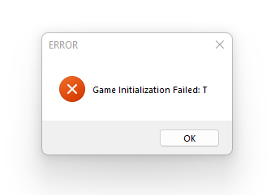
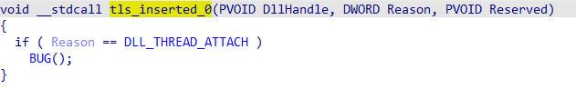
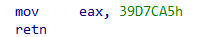
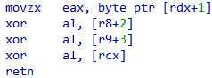

# World of Warcraft Loader Research

by Denys Volodarskyi, 2022

This text covers some points on the game startup process (loader part).
It is created for information purposes and is not meant for cracking or bypassing software protection.

## Overview

Game executable is highly obfuscated to confuse disassembler tools. 
It obscures control flow and data flow and has protection against debugging and code hooking.

Loader will create a copy of the executable image in the memory, decrypt it,
process imports and relocations and set a real entry point.

If there was some error preparing the image,
code at the executable entry point will display the following message and exit process.

There is a code displaying where the error happened.

In this case the code is **T**.
It is the first code meaning the first TLS callback was not called.

## Loading Steps

[T](#step-t), [U](#step-u), [I](#step-i), [M](#step-m), [F](#step-f), [D](#step-d), [C](#step-c)

### Step T

Shows if no **TLS** callbacks were called.
Normally should never happen.

### Step U

Execution starts from the first **Thread Local Storage** callback.

Second and third initial callbacks are encrypted at this point and 
will be available after decryption is done and 
loader transfers control to the real entry point.

These two callbacks are:

* __dyn_tls_init
* __dyn_tls_dtor

First callback sets step ``U`` and does further processing
if TLS callback reason is ``DLL_PROCESS_ATTACH``.

* Checks stack.
* Creates a buffer filled with random bytes generated from rdtsc instruction.
  It is used to encrypt and decrypt field values at runtime.
  Size is 0x1008.
* Set variables for available CPUID features.

Checks for debugger and exits if PEB Heap Flags equals 0x70.

Items in the TLS callbacks array are shifted and 3 new addresses inserted at the array start.

> Windows loader executes callbacks one by one until it finds 0 value.

Execution will continue from the second address in the updated TLS callback array. Other addresses point to encrypted memory. So other routines will be available after code unpacking is done in the 2nd callback.

First inserted callback will execute ``ud2`` undefined instruction on thread attach
(kind of debugger anti-attach).

Third inserted callback will do [Step C](#Step-C).

### Step I

**Inserted TLS callback**

It is the second address inserted into the TLS callback array in the previous step.

It sets step ``I`` and calls a function to map the executable image with 2 arguments: module base and reason.

It is the biggest step and it’s executed If the reason is ``DLL_PROCESS_ATTACH``.

#### Relocations overlapping page boundaries
Creates a table of some (probably invalid) relocations (overlapping page boundaries) with address and pointer size.
Normally there should be no relocations overlapping page boundaries

#### VEH installation
Call a function that will get needed APIs and install **Vectored Exception Handler**.
The function takes ``kernel32`` and ``ntdll`` module addresses.
See [Installing Vectored Exception Handler](#installing-vectored-exception-handler) and
[Vectored Exception Handler](#Vectored-Exception-Handler).

#### Avoid some module
Decrypts a structure containing the hash of some module name.
If this module is found in the process, the loader will exit.

Currently it’s not known what module it tries to avoid.

#### Layout Structure

Decrypts a structure containing:

* Address of real entry point 
* A list of regions to map
* A list of regions to decrypt

Exits if PEB BeingDebugged flag is set.

Allocates structure (**Map Structure**) containing info for mapping
and function code that will do the mapping.
Map function address range is added to the [Internal Regions](#Internal-Regions).

Creates a section with ``NtCreateSection`` and ``PAGE_EXECUTE_READWRITE`` page protection.
Maps the section into the current process with ``MapViewOfFileEx``.
Copies image memory to the section view.

**``wbinvd``** instruction will trigger exception and move execution to
[Vectored Exception Handler](#vectored-exception-handler).

Set step to ``M``.

### Step M

**Mapping**

Calls mapping function.
It will unmap the original image and map regions prepared earlier.

Adds a 16-byte region (2 pointers, on a 64-bit system) to the [Internal Regions](#Internal-Regions).
It will contain the code section address.

> todo: needs more research

### Step F

**Imported Functions**

Set step to F.

Get APIs: ``LoadLibraryA``, ``GetProcAddress``, ``VirtualAlloc``.

Add IAT directory to [Internal Regions](#Internal-Regions).

Decrypt import table.

Generate import bridges in allocated memory.

***

Import data directory in the PE file has both address and size fields set.

Address field points to fake imports which are visible for disassembler, but not really used.

Address field can be safely replaced with the real address after decryption.

Size field has an encrypted address of the real import table. The table, library names, function names and pointers are encrypted and must be read and decrypted in specific order.

Size field can be safely set to zero after decryption.

The IAT data directory has a valid size but invalid pointer (points to fake IAT).

Delay Import (if present) is not encrypted or protected.

### Step D

**Decryption**

Set step to D.

Observed version has 32 regions max to decrypt.
Typically there is only one region to decrypt the code section.

Decryption is done page by page.
Loader part of the code section is skipped.

Computes decryption key based on page index (page RVA divided by page size) and checksum of previously decrypted page.

Decrypt page, update checksum and move to the next page.

#### Thread anti-debug

``NtSetInformationThread(ThreadHideFromDebugger)`` for current thread.

Checks that there was no ``0xCC`` breakpoint at thread start address.

> todo: needs more research

### Step C

Set step C.

Overwrites TLS callback #1,#2 addresses ([Step I](#step-i), [Step C](#step-c)) with the same value,
pointer to dummy code to hide these callbacks.
Dummy code is like this.

Modifies entry point in mapped image writing ``JMP`` opcode
to address from [Layout Structure](#Layout-Structure).

## TLS after loader done

|#|Short|Description|
|-|-|-|
|0|UD2|UD2 on DLL_THREAD_ATTACH|
|1|Dummy|Hides Step I callback|
|2|Dummy|Hides Step C callback|
|3|__dyn_tls_init|Original callback|
|4|__dyn_tls_dtor|Original callback|

## Installing Vectored Exception Handler

Function will search following APIs and install [Vectored Exception Handler](#Vectored-Exception-Handler):

* ``RtlAddVectoredExceptionHandler`` from **ntdll**.
* ``RtlRemoveVectoredExceptionHandler`` from **ntdll**.
* ``NtCreateSection`` from **ntdll**.
* ``CloseHandle`` from **kernel32**.
* ``MapViewOfFileEx`` from **kernel32**.
* ``UnmapViewOfFile`` from **kernel32**.
* ``VirtualAlloc`` from **kernel32**.
* ``VirtualProtect`` from **kernel32**.

## Vectored Exception Handler

It does tricky decryption of part of the loader code to fool CPU emulators.
It relies on number of counters and when each counter reach specified value,
next part of the job is done.
Each part will check debug registers and clear them in case it detects debugging.

### EXCEPTION_PRIV_INSTRUCTION

If the instruction is ``hlt`` (opcode ``0xF4``) or ``wbinvd`` (opcodes ``0xF,0x9``),
the instruction will be skipped.

### EXCEPTION_SINGLE_STEP

> todo: needs more research

There are a series of functions depending one on another that will eventually lead to decryption of needed code.

Functions checks if the ``DR7`` register is not 0
(i.e. there are debugger breakpoints)
to detect a debugger and do some useful work.

Each function increments its own counter on each call and will do useful work when the counter reaches some value.

Calls are chained and only when all calls are satisfied, needed code will be decrypted.

If the debugger is detected, the exception handler will set the RDX register to 0 and the next IP to the following code. So it will trigger memory access violation.

## Notes

### API
Exported functions are found by hashes of DLL name and function name.

Module is found via ``PEB`` ``InMemoryModuleList``
and its export table is used to find a function by name hash.

### Decryption
Modified ``RC4`` algorithm is used to decrypt some blocks during loader execution.
Keys are taken from constant buffer, where key positions and sizes for each block may vary.

### Anti-Debug

> This list may be incomplete

* PEB Heap Flags
* PEB BeingDebugged
* ThreadHideFromDebugger
* Check APIs and thread starts with 0xCC (int 3) opcode.
* Check call return address is within the expected code section (either loader or game code section).
* DR registers

### Anti-Analysis

#### Internal Regions

All data used in loading process, loader code, TLS callbacks code,
imports info and other is garbaged after loader is done.

#### Code Obfuscation 

> This list may be incomplete

* always executed branch
* never executed branch
* branch into the middle of the existing instruction
* dead code
* constant obfuscation
* checks return address to be in expected address range (anti-hook)
